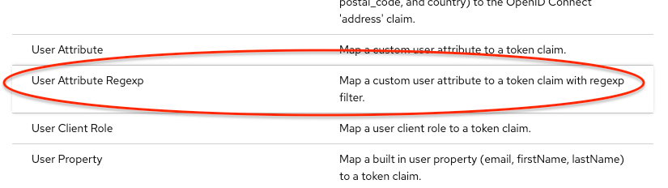
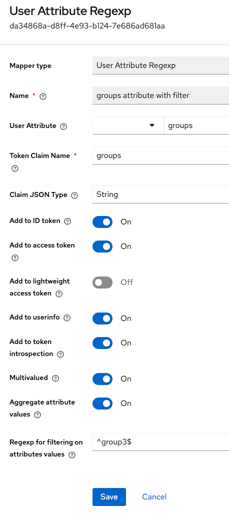

# Protocol mapper group filter membership with regexp

*By please-open.it*

This mapper allows to filter user attributes that only fits to a regexp (by value).

It avoids mapping all user attributes values into a token.

## Installation

mvn clean install

Copy generated JAR file from "deployment" directory into "providers" in Keycloak. Restart Keycloak.

## Usage

We recommend a dedicated scope for this mapper.

Add a mapper with "Add Mapper" then "by configuration"

The configuration is the same as the "user attribute" mapper in Keycloak, except on "regexp" field ;

The module use "Pattern" : https://docs.oracle.com/javase/8/docs/api/java/util/regex/Pattern.html